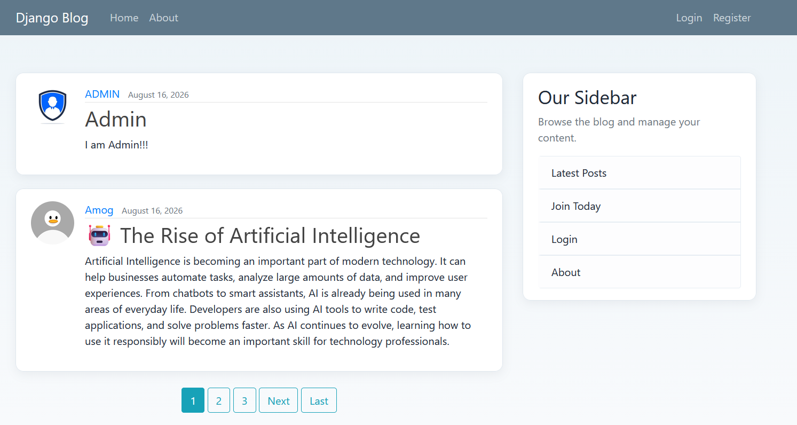
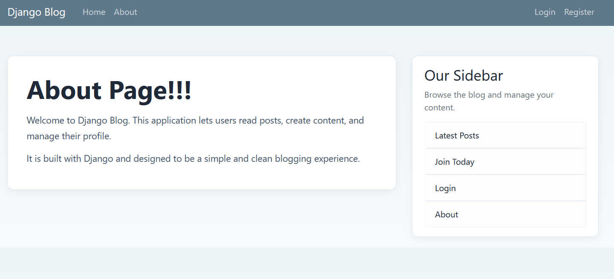
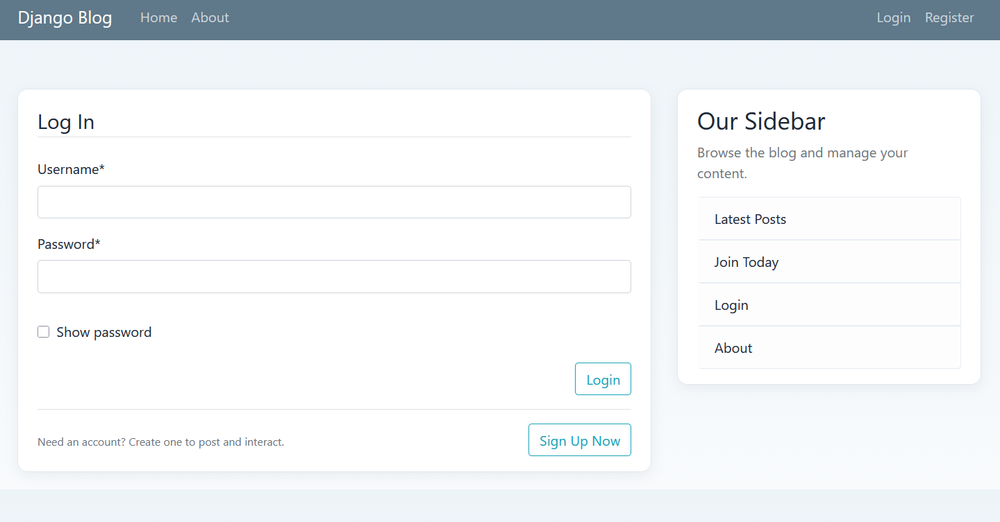
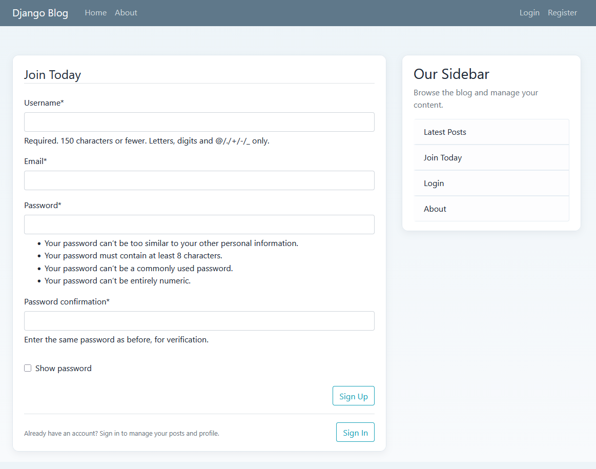

# Django Blog

A simple Django blog web application for creating and managing blog posts, user profiles, and authentication-based access to content.

## Features

- Blog home page displaying the latest posts with pagination
- Individual post detail pages
- Create, update, and delete blog posts
- User-specific post pages for viewing posts by author
- User registration and login/logout flows
- Password reset routes using Django's built-in authentication views
- User profile page for editing username/email and uploading a profile image
- Profile image validation for size and file type using Pillow
- Responsive sidebar navigation and navigation bar
- About page
- Django admin integration for admin/staff access
- Staff and superuser checks for post update/delete permissions

## Tech Stack

- Python
- Django 5.2.11
- SQLite
- HTML, CSS, JavaScript
- Bootstrap 4.4.1 (CDN)
- django-crispy-forms
- crispy-bootstrap5
- Pillow

## Project Structure

```text
.
├── blog/
│   ├── migrations/
│   ├── static/
│   ├── templates/
│   ├── apps.py
│   ├── models.py
│   ├── urls.py
│   └── views.py
├── myproject/
│   ├── settings.py
│   ├── urls.py
│   └── wsgi.py
├── users/
│   ├── migrations/
│   ├── templates/
│   ├── apps.py
│   ├── forms.py
│   ├── models.py
│   ├── signals.py
│   └── views.py
├── media/
│   └── profile_pics/
├── screenshots/
├── manage.py
├── db.sqlite3
├── .gitignore
├── scripts/
├── backups/
└── README.md
```

## Screenshots









## Installation & Setup

1. Clone the repository:

```bash
git clone <repository-url>
cd BlogCreation
```

2. Create and activate a virtual environment:

```bash
python -m venv venv
```

On Windows PowerShell:

```powershell
.\venv\Scripts\Activate.ps1
```

On Windows Command Prompt:

```cmd
venv\Scripts\activate.bat
```

3. Install dependencies:

```bash
pip install -r requirements.txt
```

4. Apply database migrations:

```bash
python manage.py migrate
```

5. Create a superuser if you want admin access:

```bash
python manage.py createsuperuser
```

6. Start the development server:

```bash
python manage.py runserver
```

Then open the app in your browser at:

```text
http://127.0.0.1:8000/
```

## Usage

- Register a new user from the registration page.
- Log in to create or edit your own blog posts.
- Visit the home page to browse the latest posts and pagination.
- Open a post to view the full content and related author information.
- Use the profile page to update username/email and upload a profile image.
- Use the sidebar links to move between home, about, and author-specific content.
- Access the Django admin site at `/admin/` for administrative management.

## Database

The project uses SQLite as its default database backend. This is configured in `myproject/settings.py` with the database file located at `db.sqlite3`.

## Authentication & Authorization

The application uses Django's built-in authentication system based on the default `User` model.

Implemented behavior includes:

- User registration using `UserCreationForm`
- Login and logout views
- Login redirect configured to the blog home page
- Profile access restricted to authenticated users via `@login_required`
- Post creation requires login
- Post update and delete checks ensure the author can modify/delete their own post
- Staff and superuser users are also allowed to update/delete posts
- Admin access is available through Django's admin interface at `/admin/`
- The project includes a password reset workflow using Django authentication templates and routes

## Future Improvements

- Add comments or discussion threads to posts
- Add categories or tags for blog organization
- Improve media storage for production deployment
- Add user roles beyond the default Django staff/superuser model
- Add automated tests for blog and auth workflows
- Add deployment configuration for a production web server and static/media hosting

## Author

Author: Vini <Vini@gmail.com>

## License

No license file was found in the repository, so no project license is currently specified.
